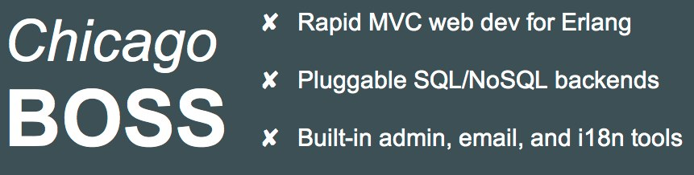
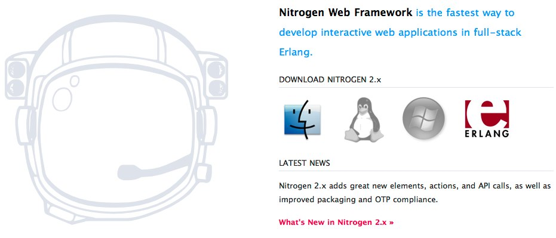
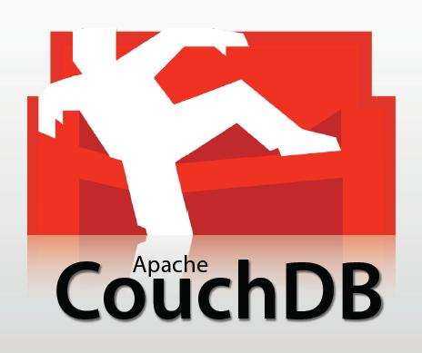

!SLIDE bullets incremental

# Erlang Community

* [http://www.erlang.org/](http://www.erlang.org/)
* Erlang User Conference
* Erlang Camp
* Erlang Factory

!SLIDE bullets incremental smaller

# Erlang on Github

* rklophaus/Nitrogen Web Framework for Erlang
* tarcieri/Reia is a Ruby/Python-like language for BEAM, the Erlang VM
* mojombo/Ernie is an Erlang/Ruby BERT-RPC Server.
* mojombo/Erlectricity exposes Ruby to Erlang and vice versa.
* mojombo/BERT (Binary ERlang Term) serialization library for Ruby.
* evanmiller/The MVC for Erlang hackers in a hurry

!SLIDE center

# Erlang for Web Development

* 

!SLIDE center

# Erlang for Web Development

* 

!SLIDE center

# CouchDB

* 

!SLIDE bullets incremental

##Learn Erlang

* [Try Erlang](http://tryerlang.org)
* [Learn you some erlang](http://learnyousomeerlang.com/)

!SLIDE bullets incremental

##Learn Erlang (Books)

* [Programming Erlang](http://www.amazon.com/Programming-Erlang-Software-Concurrent-World/dp/193435600X/ref=sr_1_2?s=books&ie=UTF8&qid=1285605788&sr=1-2)
* [Erlang Programming](http://www.amazon.com/ERLANG-Programming-Francesco-Cesarini/dp/0596518188/ref=sr_1_1?s=books&ie=UTF8&qid=1285605788&sr=1-1)
* [Erlang OTP](http://www.amazon.com/Erlang-OTP-Action-Martin-Logan/dp/1933988789/ref=sr_1_3?s=books&ie=UTF8&qid=1285605788&sr=1-3)
* [Seven Languages](http://www.amazon.com/Seven-Languages-Weeks-Pragmatic-Programming/dp/193435659X/ref=sr_1_4?s=books&ie=UTF8&qid=1285605788&sr=1-4)
* [Mastering Erlang](http://www.amazon.com/Mastering-Erlang-Writing-World-Applications/dp/1430227699/ref=sr_1_7?s=books&ie=UTF8&qid=1285605788&sr=1-7)

!SLIDE bullets

##Learn Erlang (Other)

* [http://pragprog.com/screencasts/v-kserl/erlang-in-practice](http://pragprog.com/screencasts/v-kserl/erlang-in-practice)
* On Twitter: [@erlang101](http://twitter.com/erlang101)

!SLIDE bullets incremental

##Installation

* [Homebrew](http://wiki.github.com/mxcl/homebrew/installation)
* `brew install erlang`
* or
* [http://www.atmos.org/cinderella/intro.html](http://www.atmos.org/cinderella/intro.html)
* other: macports, apt-get, etc.
