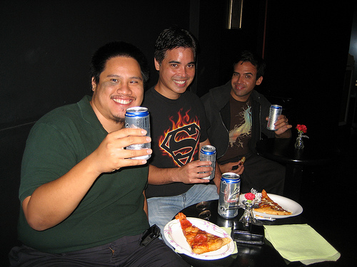

!SLIDE incremental bullets

# Talk Outline

* What is Erlang?
* Why Erlang?
* Learn basic Erlang syntax through Ruby
* Erlang libraries and web frameworks
* References

!SLIDE incremental bullets

# Goals

* No language wars here!
* Apply functional principles to Ruby
* Passionate about languages
* Keep options open
* Great developer > great Ruby developer

!SLIDE incremental bullets

#Why am I here?

* I like technology
* I like hanging out with other developers
* I like to develop software
* Lately I've been playing around with Erlang

!SLIDE incremental bullets smaller

#Why are you here?

*  
* [Credit](http://www.flickr.com/photos/hawyn316/2946197060/sizes/m/in/photostream/)

!SLIDE incremental bullets

#Why are you really here?

* You like technology
* Like to meet other developers
* LIke to develop software
* You'd like to try out Erlang
